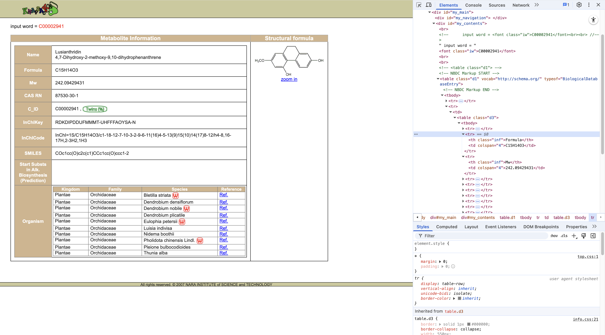
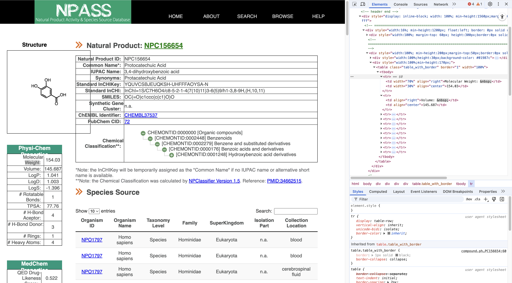
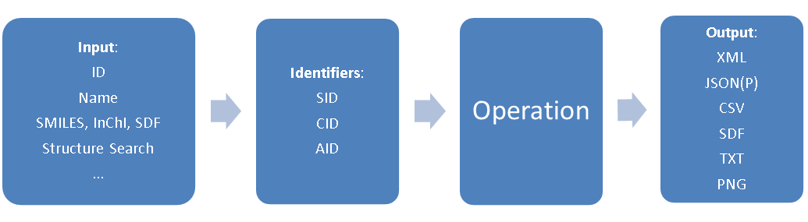

While I was leisurely slacking off in the lab, a WeChat message from my advisor suddenly broke my peace. Turns out he sent me a Selenium tutorial from a WeChat public account, asking me to use web scraping to get a reference table of chemical constituents for the mass spec data of medicinal herbs. That’s how this set of notes came about.

## PubChem

I just learned Selenium, so I jumped straight in without much thought—only to realize afterward that this was definitely a mistake. My advisor’s research focuses on Dendrobium Nobile, so I searched for it on PubChem, and sure enough, found [Taxonomy](https://pubchem.ncbi.nlm.nih.gov/taxonomy/94219). Scrolling down, I saw that the Chemicals and Bioactivities list can be downloaded. Click and download—done, back to slacking off.

But it wasn’t that simple. The file `pubchem_taxid_xxxxx_consolidatedcompoundtaxonomy.csv` only contains the compound names, IDs, and links to the source databases. For mass spec data analysis, I at least need the chemical formula and molecular weight. Checking the links, I realized the Dendrobium data mainly comes from the following three databases:

1. [KNApSAcK Species-Metabolite Database](https://pubchem.ncbi.nlm.nih.gov/source/KNApSAcK%20Species-Metabolite%20Database)
2. [Natural Product Activity and Species Source (NPASS)](https://pubchem.ncbi.nlm.nih.gov/source/Natural%20Product%20Activity%20and%20Species%20Source%20(NPASS))
3. [Wikidata](https://pubchem.ncbi.nlm.nih.gov/source/23756)

This is the perfect use case for a web scraper. For each compound, all I need to do is visit the corresponding database entry sequentially and record its formula and molecular weight. Since PubChem exports Metabolites and Natural Products as two separate `.csv` files, I wrote a simple script to merge them:

```python
#!/usr/bin/env python3
import os
import sys
import pandas as pd

def main():
    input_files = ['metabolites.csv', 'natural_products.csv']
    dfs = []

    for fname in input_files:

        # Load and validate each input file
        if not os.path.isfile(fname):
            sys.exit(f"Input file not found: {fname}")

        # Read only the necessary columns from the CSV
        df = pd.read_csv(
            fname,
            usecols=['Compound_CID', 'Compound', 'Source_Chemical', 'Source_Chemical_URL']
        )
        dfs.append(df)

    # Concatenate both DataFrames into a single one
    combined = pd.concat(dfs, ignore_index=True)
    # Remove duplicate entries based on Compound_CID, keeping the first occurrence
    combined = combined.drop_duplicates(subset=['Compound_CID'], keep='first')

    output_file = 'pubchem_combined.csv'
    combined.to_csv(output_file, index=False)
    print(f"Merged CSV written to: {output_file}")

if __name__ == "__main__":
    main()
```

## Selenium

The logic for the web scraper script is fairly straightforward:

1. Use the merged `.csv` file from above as the input, with each row containing a `Source_Chemical_URL` column pointing to the respective database entry.
2. For each URL, use [XPath](https://www.w3schools.com/xml/xpath_syntax.asp) and a site-specific parser to extract the required data from the page’s HTML structure.
   1. Use modular design, with a dispatcher to call different parsers based on the domain (NPASS, Knapsack, or Wikidata).
3. After parsing, write the results back to the `.csv` file, adding two columns: molecular weight and chemical formula.

### Basic Configuration

First, configure [ChromeDriver](https://developer.chrome.com/docs/chromedriver):

```python
def setup_driver(headless=False):

    # Finds the chromedriver executable in your system
    chromedriver_path = shutil.which("chromedriver")
    if not chromedriver_path:
        sys.exit("ERROR: chromedriver executable not found in PATH.")

    # Sets up Chrome options (headless if requested)
    options = webdriver.ChromeOptions()
    options.page_load_strategy = 'eager'
    if headless:
        options.add_argument('--headless=new')
        options.add_argument('--disable-gpu')

    # Returns a webdriver.Chrome instance
    service = Service(chromedriver_path)
    driver = webdriver.Chrome(service=service, options=options)
    # driver.set_page_load_timeout(PAGE_LOAD_TIMEOUT)   # npass websites are really slow
    return driver
```

Next, set the parameters. Here, the timeout is set to 30 seconds and the interval between fetches to one second. Since NPASS loads slowly, a longer timeout is actually needed. In practice, I removed the `TimeoutException`.

```python
PAGE_LOAD_TIMEOUT = 30  # how long to wait for a page to load
DEFAULT_PAUSE = 1.0   # seconds to wait between scrapes to avoid overloading servers
```

### Parsers

#### Knapsack



Knapsack stores data in this structure:

```html
<tr>
   <th class="inf">Formula</th>
   <td colspan="4">C15H14O3</td>
</tr>
<tr>
   <th class="inf">Mw</th>
   <td colspan="4">242.09429431</td>
</tr>
```

The data is stored as “structured rows”: in each `<tr>` element, `<th>` is the label and `<td>` is the value. So I wrote a simple `get_text_label_in_table` helper to reliably match the text in `<th>` (such as "Formula" or "Mw") and then obtain the adjacent `<td>`.

Here’s the code:

```python
# Looks in a table for a row with the given label and gets the corresponding value from the same row
# Find any table row <tr> where the first cell (whether it's a <th> or <td>) exactly matches the label.
def get_text_label_in_table(driver, label):   
    try:
        row = driver.find_element(
            By.XPATH,
            f"//table//tr[normalize-space(.//th[1] | .//td[1])='{label}']"
        )
        return row.find_element(By.XPATH, './td[1]').text.strip()
    except NoSuchElementException:
        return None

# Parser for Knapsack
# Extracts Formula and Mw from chemical entry pages on knapsackfamily.com using table-based scraping
def parse_knapsack(driver):
    formula = get_text_label_in_table(driver, 'Formula')
    weight = get_text_label_in_table(driver, 'Mw')
    if weight is None:
        weight = get_text_label_in_table(driver, 'Molecular weight')
    return weight, formula
```

#### NPASS



```html
<tr>
  	<td width="70%" align="right">Molecular Weight: &nbsp;</td>
  	<td width="30%" align="center">154.03</td>
</tr>
```

NPASS is a bit trickier. Sometimes it uses `<dt>/<dd>` as definition tags, but in other cases it uses regular tables without `<th>`, placing the text directly in `<td>`. So I needed more logic:

1.	First, try to extract from `<dt>/<dd>` (preferred method).
2.	If not found, search for `td[1][contains(normalize-space(.),'Molecular Weight')]` and then get the value in the next `<td>`.

Here’s the code:

```python
# Parser for NPASS
# Extracts Formula and Molecular Weight from npass.bidd.group using <dt>/<dd> tags and fallbacks to table parsing if needed
def parse_npass(driver):

    # Try extracting formula from <dt>/<dd>
    try:
        formula = driver.find_element(
            By.XPATH,
            "//dt[contains(normalize-space(),'Molecular Formula')]/following-sibling::dd[1]"
        ).text.strip()
    except NoSuchElementException:
        formula = None
    
    # Try extracting weight from <dt>/<dd>
    try:
        weight = driver.find_element(
            By.XPATH,
            "//dt[contains(normalize-space(),'Molecular Weight')]/following-sibling::dd[1]"
        ).text.strip()
    except NoSuchElementException:
        weight = None

    # NPASS often uses a <table class="table_with_border">…</table> for Mw;
    # if the dt/dd lookup failed or returned '0', fall back to grabbing from the table.
    if not weight or weight == '0':
        try:
            weight = driver.find_element(
                By.XPATH,
                "//table[contains(@class,'table_with_border')]"
                "//tr[td[1][contains(normalize-space(.),'Molecular Weight')]]/td[2]"
            ).text.strip()
        except NoSuchElementException:
            weight = None

    return weight, formula
```

#### Wikidata

When I wrote a parser for Wikidata, I realized that Wikidata provides an API, and there’s a [`wbgetentities`](https://www.wikidata.org/w/api.php?action=help&modules=wbgetentities) function. So I can directly get a clean `JSON` file at `https://www.wikidata.org/w/api.php?action=wbgetentities&ids=QXXX&props=claims&format=json`:

```json
{
  "entities": {
    "Qxxx": {
      "claims": {
        "P274": [...],  // Formula
        "P2067": [...]  // Molecular weight
      }
    }
  }
}
```

All I need is to read the values from the `JSON` file:

```python
# Parser for Wikidata
# Uses the Wikidata API to extract:
#   P274: chemical formula
#   P2067: molecular weight
# Handles potential nested dictionary responses
def parse_wikidata(entity_id):
    import urllib.request, json

    api_url = (
        'https://www.wikidata.org/w/api.php'
        '?action=wbgetentities&ids=%s&props=claims&format=json' % entity_id
    )
    try:
        with urllib.request.urlopen(api_url, timeout=PAGE_LOAD_TIMEOUT) as f:
            data = json.load(f)
        claims = data['entities'][entity_id]['claims']
        formula = None
        weight = None
        if 'P274' in claims:
            formula = claims['P274'][0]['mainsnak']['datavalue']['value']
        if 'P2067' in claims:
            weight = claims['P2067'][0]['mainsnak']['datavalue']['value']
            # Wikidata returns a dict {'amount': '+<value>', 'unit': ...}; extract the numeric amount
            if isinstance(weight, dict):
                raw_amount = weight.get('amount')
                weight = raw_amount.lstrip('+') if raw_amount is not None else None
        return weight, formula
    except Exception as e:
        print(f"WARNING: failed to fetch Wikidata {entity_id}: {e}", file=sys.stderr)
        return None, None
```

Here, I realized that scraping content directly from the UI using a crawler might be a very poor choice, which I’ll revisit later in this article.

### Dispatcher

After implementing all the parsers, I also needed a dispatcher to select the correct parser based on the domain in the URL. The structure is very simple:

```python 
# Dispatcher: Determine Which Parser to Use
def dispatch_parse(driver, url):
    hostname = urlparse(url).hostname or ''
    if 'knapsackfamily.com' in hostname:
        driver.get(url)
        return parse_knapsack(driver)
    if 'bidd.group' in hostname:
        driver.get(url)
        return parse_npass(driver)
    if 'wikidata.org' in hostname:
        entity_id = url.rstrip('/').rsplit('/', 1)[-1]
        return parse_wikidata(entity_id)
    print(f"WARNING: no parser available for {url}", file=sys.stderr)
    return None, None
```

### CLI

I wanted my script to work as a general tool, so I wrote a simple command-line interface with 4 main parameters: `input_csv`, `output_csv`, `--headless`, and `--pause`.

```python
# Command-line Interface
if __name__ == '__main__':
    p = argparse.ArgumentParser(
        description='Scrape molecular weight and formula for pubchem chemicals.'
    )
    p.add_argument('input_csv', help='Input CSV (final_pubchem.csv)')
    p.add_argument('output_csv', help='Output CSV with Mw and Formula')
    p.add_argument('--headless', action='store_true', help='Run Chrome in headless mode')
    p.add_argument('--pause', type=float, default=DEFAULT_PAUSE,
                   help='Seconds to pause between requests')
    args = p.parse_args()
    main(args.input_csv, args.output_csv, args.pause, args.headless)
```

## PUG REST API

As mentioned above, when writing the Wikidata scraper, I realized that web scraping was not the most elegant solution for “retrieving reference tables of chemical constituents.” I soon learned that PubChem actually provides an API platform: [PUG REST](https://pubchem.ncbi.nlm.nih.gov/docs/pug-rest), and in fact, bulk scraping of web pages is discouraged. I quickly decided to correct my mistake and rewrote the whole script.



PUG REST queries are all based on PubChem identifiers: SID represents substance IDs, CID stands for compound IDs, and AID for assay IDs. To query information related to a substance/compound/assay, you can use a URL structure like:

> | [https://pubchem.ncbi.nlm.nih.gov/rest/pug](https://pubchem.ncbi.nlm.nih.gov/rest/pug) | **/compound/name/vioxx** | **/property/InChI** | **/TXT** |
> | ------------------------------------------------------------ | ------------------------ | ------------------- | -------- |
> | *prolog*                                                     | *input*                  | *operation*         | *output* |

It also supports a wide array of output formats:

> | Output Format | Description                                               |
> | ------------- | --------------------------------------------------------- |
> | XML           | standard XML, for which a schema is available             |
> | JSON          | JSON, JavaScript Object Notation                          |
> | JSONP         | JSONP, like JSON but wrapped in a callback function       |
> | ASNB          | standard binary ASN.1, NCBI’s native format in many cases |
> | ASNT          | NCBI’s human-readable text flavor of ASN.1                |
> | SDF           | chemical structure data                                   |
> | CSV           | comma-separated values, spreadsheet compatible            |
> | PNG           | standard PNG image data                                   |
> | TXT           | plain text                                                |

With this, I could quickly batch query a CID list via the API platform, while customizing what I wanted to retrieve. I need to call a URL like:

````python
url = f"https://pubchem.ncbi.nlm.nih.gov/rest/pug/compound/{namespace}/property/{props}/JSON"
````

Here, `namespace` is a comma-separated list of CIDs, and `props` can be any one or more [supported PUG REST property fields](https://pubchem.ncbi.nlm.nih.gov/docs/pug-rest#section=Compound-Property-Tables).

So, I can write a helper for querying:

```python
payload = {namespace: ",".join(ids), "property": props}
backoff = 1.0

for attempt in range(retries):
    try:
        r = SESSION.post(url, data=payload, timeout=30)
        r.raise_for_status()
        data = r.json()["PropertyTable"]["Properties"]
        key_field = "CID" if namespace == "cid" else "Name"
        return {str(item[key_field]): item for item in data}
    except Exception as exc:
        if attempt == retries - 1:
            raise
        time.sleep(backoff)
        backoff *= 2
        continue
```

For a compound table with a column of CIDs (such as the merged table from before), I can quickly batch query their chemical formula and molecular weight, then add the information as new columns:

```python
df = pd.read_csv(in_path)
if args.id_column not in df.columns:
    sys.exit(f"Column {args.id_column!r} not found in {in_path}")

# ensure CID keys are clean strings without '.0'
if args.cid:
    ids = df[args.id_column].astype(int).astype(str).tolist()
else:
    ids = df[args.id_column].astype(str).tolist()
namespace = "cid" if args.cid else "name"

# load cache if present
cache: Dict[str, Dict[str, str]] = {}
if cache_path:
    cache = load_cache(cache_path)

# figure out which IDs still need querying
to_query = [i for i in ids if i not in cache]
print(f"{len(ids)} total IDs  /  {len(to_query)} to query (cached {len(ids)-len(to_query)})")

# batch loop
for i in range(0, len(to_query), args.batch_size):
    batch = to_query[i : i + args.batch_size]
    print(f"Fetching batch {i // args.batch_size + 1}  (size {len(batch)}) ...", end="", flush=True)
    try:
        props_dict = pug_request(namespace, batch, args.props)
        cache.update(props_dict)
        print(" done.")
    except Exception as exc:
        print(f" failed ({exc}).")
    time.sleep(args.sleep)

# save cache
if cache_path:
    save_cache(cache, cache_path)
    # optionally remove cache file after run
    if args.auto_delete_cache and cache_path.exists():
        cache_path.unlink()
        print("Deleted cache", cache_path)

# add columns back to DataFrame
prop_names = args.props.split(",")
for prop in prop_names:
    key_series = (
        df[args.id_column].astype(int).astype(str)
        if args.cid
        else df[args.id_column].astype(str)
    )
    df[prop] = key_series.map(lambda x: cache.get(x, {}).get(prop, ""))
```

Using the API is much faster than using a web crawler: the time it takes for the scraper to load a single web page is enough for the API to query hundreds of compounds. Efficiency is greatly improved. Plus, I don’t have to worry about triggering database rate limits, or slow UI rendering on some databases causing timeouts.

After this, I wanted to further streamline the workflow, ideally automating the step of downloading a compound list from PubChem—so that given a Taxonomy ID, I could directly output a table including all necessary compound information. But there was a snag. PUG REST doesn’t directly link Taxonomy ID with CID; at best, I can go Taxonomy ID -> AID -> CID. The documentation explains:

> **Assays and Bioactivities**
>
> The following operation returns a list of compounds involved in a given taxonomy. Valid output formats are XML, JSON(P), ASNT/B, and TXT.
>
> [https://pubchem.ncbi.nlm.nih.gov/rest/pug/taxonomy/taxid/2697049/aids/TXT](https://pubchem.ncbi.nlm.nih.gov/rest/pug/taxonomy/taxid/2697049/aids/TXT)
>
> There is no operation available to directly retrieve the bioactivity data associated with a given taxonomy, as often the data volume is huge. However, one can first get the list of AIDs using the above link, and then aggregate the concise bioactivity data from each AID, e.g.:
>
> [https://pubchem.ncbi.nlm.nih.gov/rest/pug/assay/aid/1409578/concise/JSON](https://pubchem.ncbi.nlm.nih.gov/rest/pug/assay/aid/1409578/concise/JSON)

In practice, for many taxonomy entries—especially the natural herbal medicine taxa related to my project— `/taxonomy/taxid/xxxxxxx/aids/` just returns 404, meaning there’s no corresponding Taxonomy ID -> AID mapping in the database. So I can’t get the CID list via AIDs.

## Mass Spectrometry Software

After spending lots of time, with my amateur programming skills, building parsers and trying to automate data collection from various databases, I started to wonder if someone else had done this sort of thing—only much better. A quick search yielded this [list of mass spectrometry software](https://en.wikipedia.org/wiki/List_of_mass_spectrometry_software#De_novo_sequencing_algorithms). The field has a mature tool ecosystem; many tools are well-suited for my needs, and some even employ machine learning to directly predict protein sequences from mass spec peaks.

For example, a friend at the University of Washington mentioned they use the [Crux](https://crux.ms) toolkit developed by their school, which covers all my needs much better and faster:

> **tide-index**   Create an index of all peptides in a fasta file, for use in subsequent calls to tide-search.
>
> **tide-search**   Search a collection of spectra against a sequence database, provided either as a FASTA file or an index, returning a collection of peptide-spectrum matches (PSMs). This is a fast search engine, but it runs most quickly if provided with a peptide index built with tide-index.
>
> **comet**   Search a collection of spectra against a sequence database, returning a collection of PSMs. This search engine runs directly on a protein database in FASTA format.
>
> **percolator**    Re-rank and assign confidence estimates to a collection of PSMs using the Percolator algorithm. Optionally, also produce protein rankings using the Fido algorithm.
>
> **kojak**   Search a collection of spectra against a sequence database, finding cross-linked peptide matches.

There are also many commercial tools with similar algorithms and full-featured frontends (including web UIs), such as [InstaNovo](https://github.com/instadeepai/InstaNovo). Just upload your spectral data and get `Transformer` model predictions right away.

## Conclusion

After all my tinkering, it turns out I was just reinventing the wheel—a bit disappointing, but I don’t regret writing the scripts. It helped me understand how everything works behind the scenes; this was also my first real web scraping project. My biggest mistake was jumping straight into the "how" without considering the "why," getting too hung up on the technique of "web scraping" rather than the goal of "analyzing MS data." In scientific computing, standing on the shoulders of giants is often the way to go.